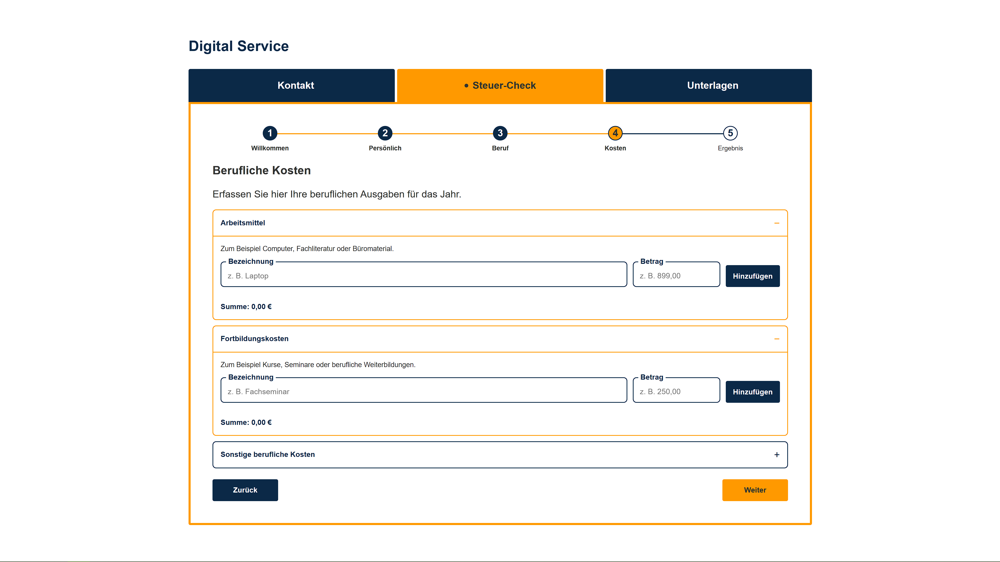
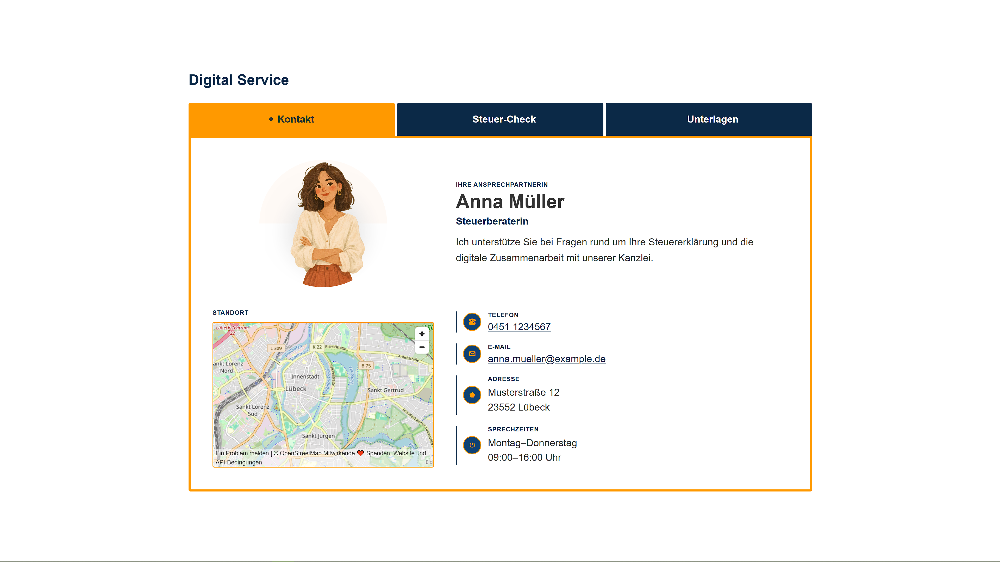
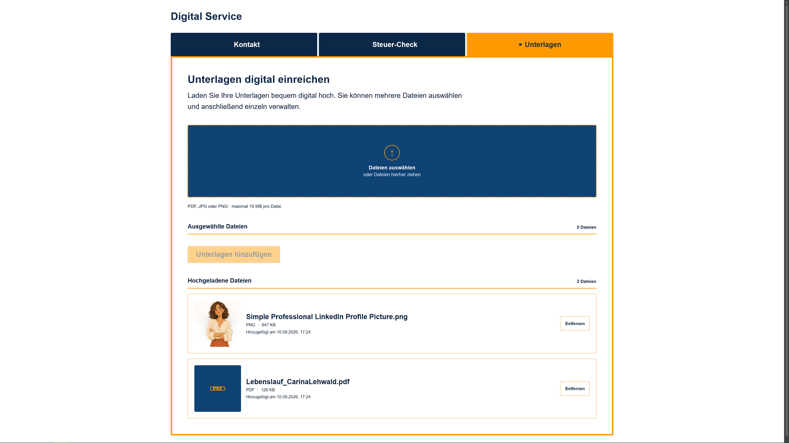
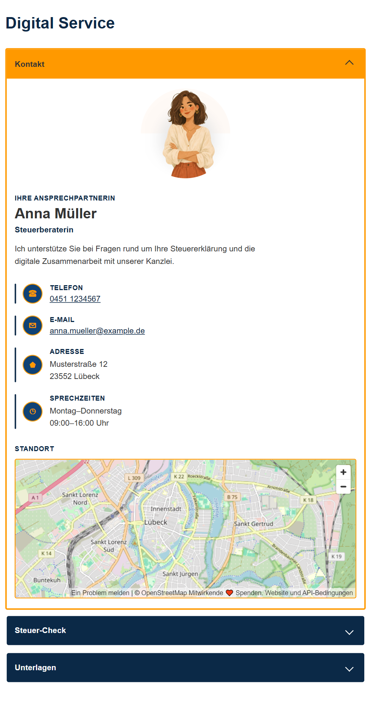
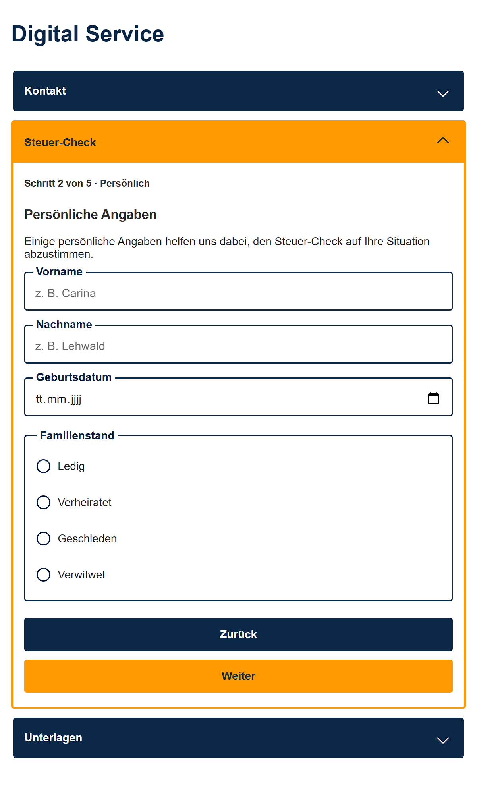

# Digital Service

Eine responsive Web-Komponente auf Basis nativer Web-Technologien mit Fokus auf **Accessibility, Wiederverwendbarkeit und einer sauberen TypeScript-Architektur**.

## Ziel

Dieses Projekt entstand im Rahmen einer Frontend-Entwicklungsaufgabe.

Die zentrale Komponente stellt drei unterschiedliche Inhaltstypen bereit und passt ihre Navigation an die jeweilige Bildschirmgröße an:

* **Desktop (≥ 800px):** Tab-Navigation
* **Mobile (< 800px):** Akkordeon

Die Entwicklung erfolgt nach dem **Mobile-First-Prinzip** mit Fokus auf:

* Accessibility
* Responsive Design
* Wiederverwendbarkeit
* Wartbarkeit
* native Web-Technologien

## Technologien

* HTML5
* CSS3
* TypeScript
* Web Components
* Native Web APIs

Es werden keine Frameworks oder UI-Libraries verwendet.

## Anforderungen

### Umgesetzt

* keine Frameworks
* keine UI-Libraries
* responsive Mobile-First-Umsetzung
* native Web Component
* TypeScript
* Tastaturbedienung
* semantische HTML-Elemente
* ARIA-Zustände für Tabs und Akkordeon
* Desktop-Tab-Navigation ab 800px
* Mobile-Akkordeon unter 800px
* Roving Tabindex für die Desktop-Tab-Navigation
* getrennte Behandlung von Fokus- und Aktivierungszuständen
* drei unterschiedliche Inhaltstypen
* responsive Gestaltung der Inhalte
* wiederverwendbare Komponentenstruktur
* Datei-Upload mit Drag & Drop
* Datei-Validierung
* Dateivorschau für unterstützte Dateitypen

### Nicht umgesetzt

* automatisierte Tests mit Vitest
* abschließende automatisierte Accessibility-Tests

Die automatisierten Tests waren als weiterer Entwicklungsschritt vorgesehen, konnten innerhalb des zeitlichen Rahmens der Aufgabe jedoch nicht mehr umgesetzt werden.

## Screenshots

Die folgenden Screenshots zeigen die responsive Darstellung der Web-Komponente und ausgewählte Inhaltstypen.

### Desktop – Steuercheck



### Desktop – Ansprechpartner



### Desktop – Unterlagen



### Mobile – Ansprechpartner



### Mobile – Steuercheck



## Start

Repository klonen und Abhängigkeiten installieren:

```bash
npm install
```

TypeScript kompilieren:

```bash
npm run build
```

Anschließend das Projekt über einen lokalen HTTP-Server starten:

```bash
npx serve .
```

Die von `serve` angezeigte lokale Adresse im Browser öffnen.

## Projektstruktur

```text
├── docs
│   ├── decisions.md
│   ├── design.md
│   ├── testing.md
│   └── screenshots
│       ├── desktop-kontaktperson.png
│       ├── desktop-steuercheck-phase-4.png
│       ├── desktop-unterlagen.png
│       ├── mobile-accordion-kontaktperson.png
│       └── mobile-accordion-steuercheck-phase-2.png
├── src
│   ├── components
│   │   ├── contact-person
│   │   ├── document-upload
│   │   ├── form-stepper
│   │   └── tax-form
│   ├── main.ts
│   ├── service-tabs.ts
│   └── styles.css
├── .gitattributes
├── .gitignore
├── index.html
├── package-lock.json
├── package.json
├── README.md
└── tsconfig.json
```

## Dokumentation

* [`decisions.md`](./docs/decisions.md) – technische Entscheidungen und ihre Begründungen
* [`design.md`](./docs/design.md) – visuelle und gestalterische Entscheidungen
* [`testing.md`](./docs/testing.md) – durchgeführte Prüfungen und aktueller Teststand

Die Entwicklungsschritte sind zusätzlich über die Git-Historie nachvollziehbar.

## Entwicklungsprozess

Das Projekt wurde schrittweise entwickelt. Dabei wurden zunächst die technische Grundlage und die responsive Navigation aufgebaut und anschließend die unterschiedlichen Inhaltstypen sowie deren responsive Darstellung ergänzt.

Der ursprüngliche Entwicklungsplan sah zusätzlich automatisierte Tests mit Vitest und eine abschließende Accessibility-Testphase vor. Aufgrund des zeitlichen Rahmens wurden diese Punkte als nächste mögliche Entwicklungsschritte dokumentiert, jedoch nicht mehr umgesetzt.

## Status

✅ **Fertiggestellt**

Die responsive Navigation mit Tab- und Akkordeon-Modus, drei unterschiedliche Inhaltstypen sowie die wesentlichen Accessibility-, Responsive- und Upload-Funktionen sind umgesetzt.

Der TypeScript-Build ist erfolgreich. Automatisierte Tests mit Vitest und eine weiterführende automatisierte Accessibility-Prüfung sind nicht Bestandteil der finalen Version.
